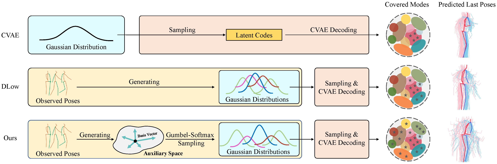

# Diverse Sampling
> Official [pytorch](https://github.com/pytorch/pytorch) project of ACMMM2022 accepted paper "[Diverse Human Motion Prediction via Gumbel-Softmax Sampling from an Auxiliary Space]()". 

**Note that another offical [reimplementation](https://github.com/Droliven/DHMP_jittor) based on [Jittor](https://github.com/Jittor/Jittor) is also available**.

[\[Paper & Supp\]](https://arxiv.org/abs/2207.07351)
[\[Poster\]]()
[\[Slides\]]()
[\[Video\]]()


## Authors

1. [Lingwei Dang](https://github.com/Droliven), School of Computer Science and Engineering, South China University of Technology, China, [levondang@163.com](mailto:levondang@163.com)
2. [Yongwei Nie](https://nieyongwei.net), School of Computer Science and Engineering, South China University of Technology, China, [nieyongwei@scut.edu.cn](mailto:nieyongwei@scut.edu.cn)
3. [Chengjiang Long](http://www.chengjianglong.com), Meta Reality Lab, USA, [clong1@fb.com](mailto:clong1@fb.com)
4. [Qing Zhang](http://zhangqing-home.net/), School of Computer Science and Engineering, Sun Yat-sen University, China, [zhangqing.whu.cs@gmail.com](mailto:zhangqing.whu.cs@gmail.com)
5. [Guiqing Li](http://www2.scut.edu.cn/cs/2017/0629/c22284a328097/page.htm), School of Computer Science and Engineering, South China University of Technology, China, [ligq@scut.edu.cn](mailto:ligq@scut.edu.cn)

## Abstract
###### &nbsp;&nbsp;&nbsp; Diverse human motion prediction aims at predicting multiple possible future pose sequences from a sequence of observed poses. Previous approaches usually employ deep generative networks to model the conditional distribution of data, and then randomly sample outcomes from the distribution. While different results can be obtained, they are usually the most likely ones which are not diverse enough. Recent work explicitly learns multiple modes of the conditional distribution via a deterministic network, which however can only cover a fixed number of modes within a limited range. In this paper, we propose a novel sampling strategy for sampling very diverse results from an imbalanced multimodal distribution learned by a deep generative model. Our method works by generating an auxiliary space and smartly making randomly sampling from the auxiliary space equivalent to the diverse sampling from the target distribution. We propose a simple yet effective network architecture that implements this novel sampling strategy, which incorporates a Gumbel-Softmax coefficient matrix sampling method and an aggressive diversity promoting hinge loss function. Extensive experiments demonstrate that our method significantly improves both the diversity and accuracy of the samplings compared with previous state-of-the-art sampling approaches.

## Overview

<a href="./assets/teaser.png">
  
</a>
  <p> Different strategies for sampling diverse results from an imbalanced multimodal distribution. The vanilla CVAE model randomly samples latent codes from a prior distribution which are then decoded into results that only reside in the major mode of the target distribution. DLow first generates multiple Gaussian distributions, and then samples latent codes from different Gaussian priors. The Gaussian priors can be viewed as corresponding to different modes of the target distribution, therefore this method can cover more modes than random sampling. Our method generates multiple Gaussian distributions by sampling points from an auxiliary space. Due to the high flexibility and capacity of the space, our method is able to cover even more modes than DLow. The rightmost are the last poses of future pose sequences predicted from a given input, all stacked together to visually show that our results are more diverse than the others.
  </p>


## Dependencies

```
Nvidia RTX 3090
Python                 3.9.7
matplotlib             3.5.0
numpy                  1.20.3
opencv-python          4.5.4.60
pandas                 1.4.2
PyYAML                 6.0
tensorboard            2.7.0
tensorboardX           2.4.1
torch                  1.10.0+cu113
torchvision            0.11.1+cu113
scipy                  1.7.2
scikit-learn           1.0.1
```

## Get the data and pretrained models

Dataset and pretrained models can be found via the [Diverse Sampling Resources Link](https://drive.google.com/drive/folders/1MIKw4bbafLeW8HYWOv5CDR5G7gYi19WZ?usp=sharing), download them and then

+ unzip `dataset.zip` to `./dataset`
+ unzip `pretrained.zip` to `./ckpt/pretrained`
+ unzip `classifier.zip` to `./ckpt/classifier`

then the dictionary becomes:

```
diverse_sampling
├─dataset
│  │  .gitignore
│  │  data_3d_h36m.npz
│  │  data_3d_h36m_test.npz
│  │  data_3d_humaneva15.npz
│  │  data_3d_humaneva15_test.npz
│  │  h36m_valid_angle.p
│  │  humaneva_valid_angle.p
│  ├─data_multi_modal
│  │      data_candi_t_his25_t_pred100_skiprate20.npz
│  │      t_his25_1_thre0.500_t_pred100_thre0.100_filtered_dlow.npz
│  └─humaneva_multi_modal
│          data_candi_t_his15_t_pred60_skiprate15.npz
│          t_his15_1_thre0.500_t_pred60_thre0.010_index_filterd.npz
└─ckpt
   ├─classifier
   │     .gitignore
   │      h36m_classifier.pth
   │      humaneva_classifier.pth
   └─pretrained
           .gitignore
           h36m_t1.pth
           h36m_t2.pth
           humaneva_t1.pth
           humaneva_t2.pth   
```

## Evaluatation


+ evaluate on Human3.6M:

  `python main.py --exp_name=h36m_t2 --is_load=1 --model_path=ckpt/pretrained/h36m_t2.pth`

+ evaluate on HumanEva-I:

  `python main.py --exp_name=humaneva_t2 --is_load=1 --model_path=ckpt/pretrained/humaneva_t2.pth`


## Calculate perceptual scores (FID and ACC)

+ For Human3.6M:

  `python main_classifier.py --exp_name=h36m_t2`

+ For HumanEva-I:
  
  `python main_classifier.py --exp_name=humaneva_t2`


## Train


+ train on Human3.6M:
  - train CVAE on Human3.6M:
  
     `python main.py --exp_name=h36m_t1 --is_train=1`
  
  - train DiverseSampling on Human3.6M:
  
    `python main.py --exp_name=h36m_t2 --is_train=1`

+ train on HumanEva-I:
    - train CVAE on HumanEva-I:
  
      `python main.py --exp_name=humaneva_t1 --is_train=1`
  
    - train DiverseSampling on HumanEva-I:
  
      `python main.py --exp_name=humaneva_t2 --is_train=1`
    
  
## Citation

If you use our code, please cite our work

```
@InProceedings{Dang_2022_acmmm,
    author    = {Dang, Lingwei and Nie, Yongwei and Long, Chengjiang and Zhang, Qing and Li, Guiqing},
    title     = {Diverse Human Motion Prediction via Gumbel-Softmax Sampling from an Auxiliary Space},
    booktitle = {Proceedings of the 30th ACM International Conference on Multimedia (ACM MM)},
    month     = {October},
    year      = {2022},
}
```

## Acknowledgments

We follow the code framework of our previous work [MSR-GCN \(ICCV 2021\)](https://github.com/Droliven/MSRGCN), and some code was adapted from [DLow](https://github.com/Khrylx/DLow) by [Ye Yuan](https://github.com/Khrylx), and [GSPS](https://github.com/wei-mao-2019/gsps) by [Wei Mao](https://github.com/wei-mao-2019). 

## Licence
MIT
